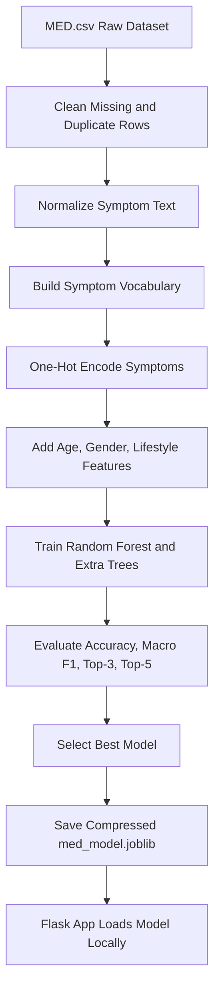
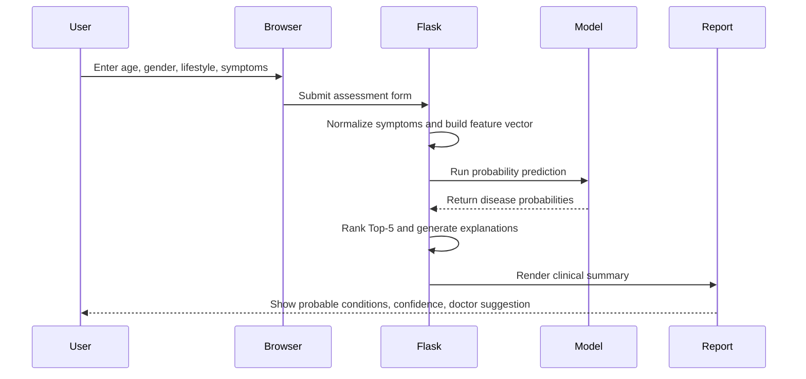

# MED+ Disease Classification System

MED+ is a local-first healthcare assessment application that predicts probable diseases from selected symptoms, age, gender, and lifestyle factors. It is designed as a preliminary clinical decision-support prototype, not as a replacement for a licensed doctor.

The application is intentionally built to run on a local system because it is not deployed on the internet due to hosting, database, domain, SSL, and cloud ML service charges.

> Disclaimer: MED+ is for educational and awareness purposes only. This is a preliminary analysis tool, not a medical diagnosis. Users should consult a qualified medical professional for diagnosis, treatment, or medication decisions.

## Key Features

- Symptom-based disease prediction using a trained machine learning model
- Searchable symptom input with selected symptom chips
- Top-5 probable disease ranking instead of one repetitive output
- Confidence score and confidence band for each prediction
- Symptom-based explanation with supporting and missing common symptoms
- Red-flag alert logic for potentially urgent symptom combinations
- Doctor specialization suggestions with local doctor directory
- Hospital-style clinical summary report
- Local execution without paid cloud deployment

## Tech Stack

| Layer | Tools |
| --- | --- |
| Language | Python |
| Backend | Flask |
| Machine Learning | scikit-learn, joblib |
| Data Processing | pandas |
| Frontend | HTML, CSS, Jinja2 templates |
| Runtime | Local browser and local Flask server |

## Application Use Case

MED+ is useful for students, researchers, and healthcare prototype demonstrations where users need a local disease classification system for learning and preliminary analysis.

Typical workflow:

- A user enters symptoms such as cough, fever, headache, urinary discomfort, rash, or abdominal pain.
- The system converts symptoms and demographics into machine-readable features.
- The ML model ranks probable disease possibilities.
- The report explains why each disease appears in the result.
- The user receives a recommended doctor specialization.
- The system reminds the user to consult a real doctor.

This application should be used only as an educational and preliminary screening tool.

## System Architecture

```mermaid
flowchart LR
    A["User on Local Browser"] --> B["Flask Web Application"]
    B --> C["Symptom Intake UI"]
    C --> D["Prediction Route /predict_disease"]
    D --> E["Feature Engineering Layer"]
    E --> F["Trained ML Model med_model.joblib"]
    F --> G["Top-5 Disease Ranking"]
    G --> H["Explanation and Red-Flag Logic"]
    H --> I["Clinical Report Page"]
    I --> J["Doctor Specialization Directory"]
```



## Machine Learning Pipeline



## User Workflow



## Project Structure

```text
MED-/
|-- app.py                    # Flask application and prediction routes
|-- train_model.py            # ML training and model artifact generation
|-- med_model.py              # Feature engineering, explanation, safety helpers
|-- MED.csv                   # Main medical dataset
|-- puneDR.csv                # Doctor and hospital directory data
|-- med_model.joblib          # Trained local model artifact
|-- symptoms.json             # Symptom vocabulary used by the UI
|-- requirements.txt          # Python dependencies
|-- templates/
|   |-- index.html            # Symptom intake page
|   |-- result.html           # Clinical report page
|   `-- doctors.html          # Doctor directory page
`-- static/
    `-- css/
        `-- styles.css        # Medical UI styling
```

## Local Setup

### 1. Clone the Repository

```bash
git clone https://github.com/KunalBadave07/MED-.git
cd MED-
```

### 2. Create a Virtual Environment

Windows:

```bash
python -m venv venv
venv\Scripts\activate
```

macOS/Linux:

```bash
python3 -m venv venv
source venv/bin/activate
```

### 3. Install Dependencies

```bash
pip install -r requirements.txt
```

### 4. Train or Regenerate the Model

```bash
python train_model.py
```

This creates or updates:

- `med_model.joblib`
- `symptoms.json`

### 5. Run the Application Locally

```bash
python app.py
```

Open the application in a browser:

```text
http://127.0.0.1:5000
```

## Prediction Logic

The application does not rely on a single fixed disease output. It uses:

- normalized symptom parsing
- symptom one-hot encoding
- demographic features
- probability-based disease prediction
- clinical-fit reranking using symptom overlap
- Top-5 disease ranking
- explanation from matched and missing disease-profile symptoms

The report displays:

- patient details
- selected symptoms
- most probable condition
- ranked differential diagnoses
- confidence levels
- supporting evidence
- common missing symptoms
- recommended doctor specialization
- preliminary care note
- medical disclaimer

## Why the App Is Local Only

The project is not deployed online because public hosting, database services, domain setup, SSL, and cloud ML hosting can introduce recurring charges. Running locally keeps the project free to test, modify, and demonstrate.

Local execution also keeps all demo data and prediction activity on the user's machine.

## Ethical and Medical Safety Notes

- MED+ does not provide a confirmed diagnosis.
- The predictions depend on the quality and size of the available dataset.
- Low-confidence results should be treated carefully.
- Severe symptoms should be evaluated by a doctor immediately.
- The system should not recommend prescription medication or replace clinical examination.

## Future Enhancements

- Add larger medically validated symptom-disease datasets
- Add ICD/SNOMED/HPO-based symptom normalization
- Improve class imbalance handling
- Add user authentication and OTP flow
- Export reports as PDF
- Add appointment booking with doctors
- Add multilingual symptom input
- Add model calibration and explainability dashboards

